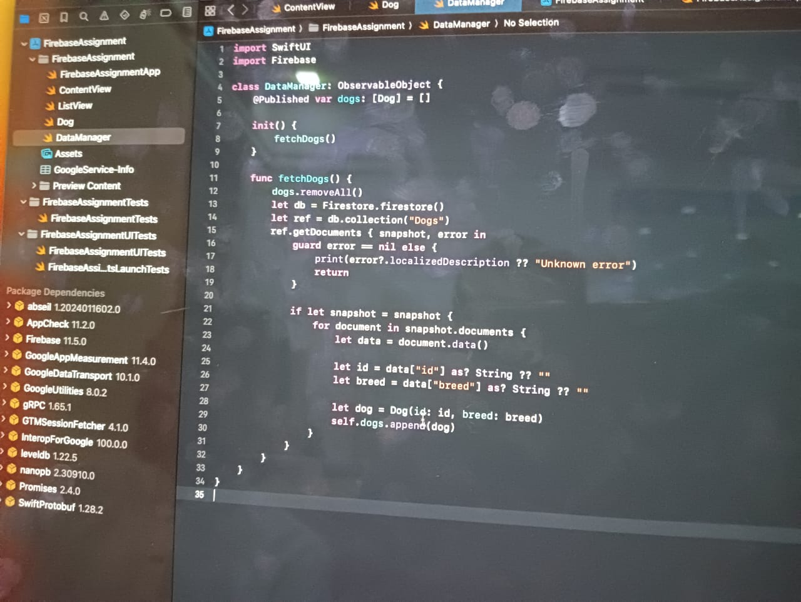
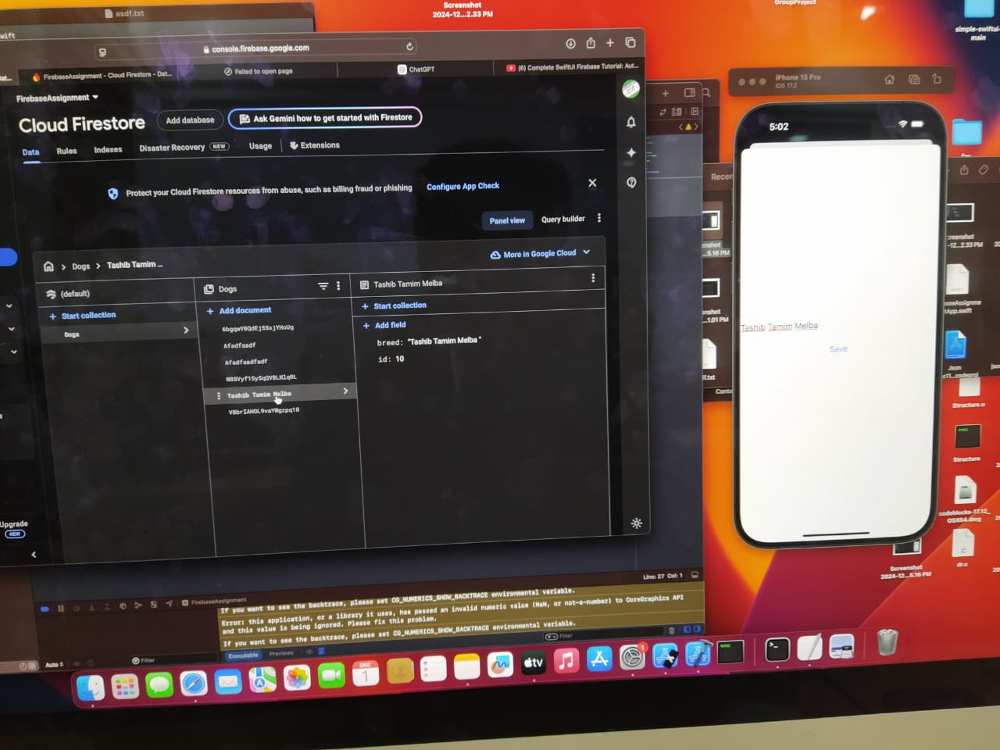
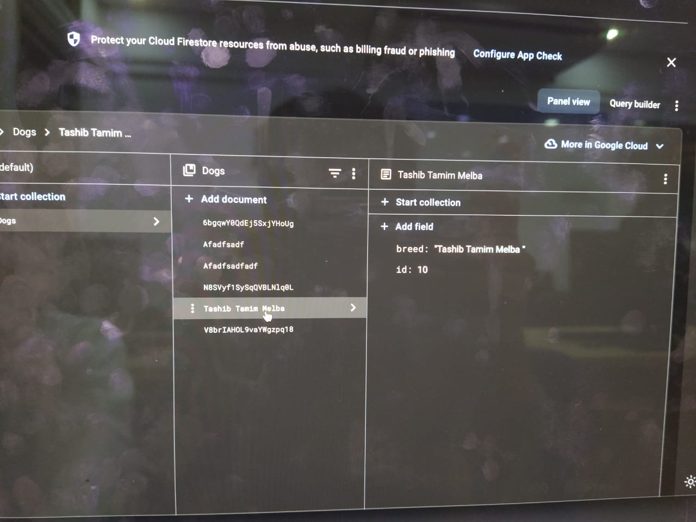
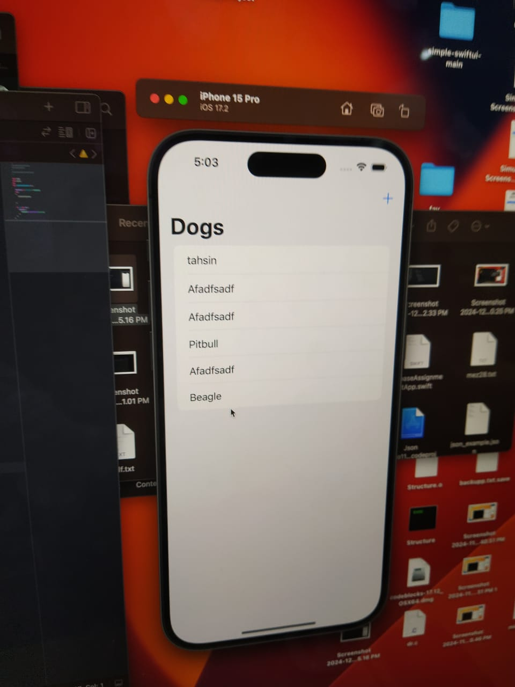

# IOS Lab 2 Assignment

## Team Members:
- **Md Rauful Islam Tamim**  
  Roll: 2007009

- **Md Tashibul Islam**  
  Roll: 2007011

- **Md Mezbaur Rahman**  
  Roll: 2007028

## 1. User Authentication Interface

## 2. User Authentication in Firebase

This image displays the Firebase Authentication setup, showing a registered user.

## 3. Authentication status in Firebase

This image displays the Firebase Authentication status.

## 4. Adding Firebase to an iOS App

This image demonstrates how to integrate Firebase into an iOS app using the GoogleService-Info.plist file.

## 5. Adding Data to Firestore

This image shows how to add a collection and document to Firestore Database.

